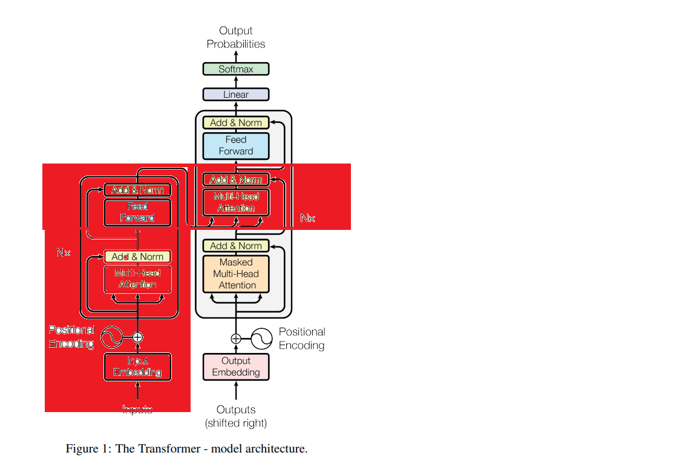

# Decoder-Only Block LLM

<div align="center" style="display: flex; align-items: center; justify-content: center; gap: 30px; margin: 40px 0; padding: 20px;">
  <div style="text-align: center;">
    
    <p style="margin-top: 10px; font-weight: bold; color: #333;">Encoder-Decoder Model</p>
  </div>
  
  <div style="display: flex; flex-direction: column; align-items: center; gap: 5px;">
    <span style="font-size: 24px; color: #2196F3;">🔄</span>
    <span style="font-size: 14px; font-weight: 600; color: #666;">TRANSFORMS TO</span>
    <span style="font-size: 24px; color: #2196F3;">➡️</span>
  </div>
  
  <div style="text-align: center;">
    
    <p style="margin-top: 10px; font-weight: bold; color: #333;">Decoder-Only Model</p>
  </div>
</div>

## Introduction

We will be making a decoder-only block to understand this better. Let us first understand what encoder and decoder are:

**Encoder**: Takes user input and then understands every token, and each token communicates with others to understand it better.

**Decoder**: Takes these encoder understandings and continues generating more tokens.

In this code, we are only generating tokens, not taking input from user. We are training the model on a Shakespeare document and making our model speak like Shakespeare.

## Building a Decoder Block

### Step 1: Tokenization

Take the sentence and tokenize it. We have multiple libraries which do this subword, but we will do it this way as computers do not understand English.

```
[a] -> [1]
...
[A] -> [27]
...
[!] -> [64]
```

In the file `input.txt`, we have 64 characters which are tokenized into 64 numbers of integers. We simply build a character-level encoder and decoder.

```python
with open('input.txt', 'r') as f:
    text = f.read()
chars = sorted(list(set(text)))
stoi = {ch: i for i, ch in enumerate(chars)}
itos = {i: ch for ch, i in stoi.items()}
```

### Step 2: Data Split

We divide 90% of data for training and the other 10% for testing. If you like, you could add 10% for validation.

```python
data = torch.tensor(encode(text), dtype=torch.long)
train_data = data[:int(0.9*len(data))]
val_data = data[int(0.9*len(data)):]
```

### Step 3: Dataset Preparation

We prepare dataset like X as input and Y as output. Imagine a sentence "I have an apple":
- X = [I hav]
- Y will be X + 1 in index = [e]

```python
def get_batch(split):
    data = train_data if split == 'train' else val_data
    ix = torch.randint(0, len(data) - block_size, (batch_size,))
    x = torch.stack([data[i:i+block_size] for i in ix])
    y = torch.stack([data[i+1:i+block_size+1] for i in ix])
    x, y = x.to(device), y.to(device)
    return x, y
```

### Step 4: BigramLanguageModel

We build a BigramLanguageModel which helps us predict the next word in this way:

We have:
- `token_embedding_table` (tokens from the word)
- `position_embedding_table` (position of token)

We add these and pass to a function block which is the actual decoder block.

#### Block Function Components:

1. **MultiHeadAttention**: Adding all parallel processing communications
2. **FeedForward**: A simple layer which learns more deeply about the patterns
3. **LayerNorm**: Simple normalization as lots of layers are added and numbers can be scaled up

#### MultiHeaded Attention

In multihead, we add all the Head function results as one. To understand better, it is like different lines understanding different parts - like one grammar and other vocabulary - and then in multihead adding all so it can learn everything.

#### Head Function

The main function is our head which does the main part of communication of tokens. It helps us understand what a token can provide and what it wants. We do not communicate with all tokens - like we have 'the' in the line which provides no value, we only communicate with important tokens.

Every token provides us with these three parts:
- **Query**: What am I looking for?
- **Key**: What do I contain?
- **Value**: What would I provide if you pick me?

Then, the higher the dot product value of query and key, the deeper or higher number weight it will get. Think of it like the weight with high number will have the highest important part in communication.

#### Masking

```python
wei = wei.masked_fill(self.tril[:T,:T] == 0, float('-inf'))
```

This line helps us prevent the AI from seeing the future tokens or results. Then simply we add softmax and dropout layer.

### Step 5: Training Loop

Start looking for the results. We set an optimizer.

Below code shows how well the model is performing after every 500 iterations:

```python
for iter in range(max_iters):
    if iter % eval_interval == 0:
        losses = estimate_loss()  
        print(f"step {iter}: train loss {losses['train']:.4f}, val loss {losses['val']:.4f}")
    
    xb, yb = get_batch('train')
    
    logits, loss = m(xb, yb)
    optimizer.zero_grad(set_to_none=True)
    loss.backward()
    optimizer.step()
```

### Testing

We tell the model to print 500 tokens which would sound like Shakespeare:

```python
context = torch.zeros((1, 1), dtype=torch.long, device=device)
print(decode(m.generate(context, max_new_tokens=500)[0].tolist()))
```
